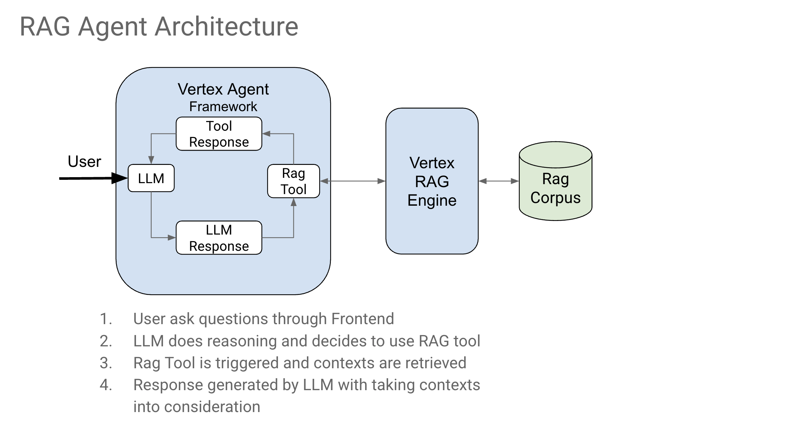
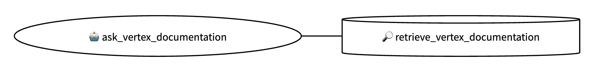

# MaxiAgent - Multi-Agent Motorcycle Finance Engine

## Overview

MaxiAgent is an AI-powered **multi-agent system** specialized in motorcycle financing for Maxikash. The system orchestrates multiple specialized agents to provide expert consultation on motorcycle credits, generate personalized quotations, and offer up-to-date information about motorcycle catalogs from partner brands (Italika, Bajaj, Vento).



The multi-agent engine combines Retrieval-Augmented Generation (RAG) technology with Google Cloud's Agent Development Kit to deliver comprehensive financial advisory services through specialized agents that handle different aspects of the customer journey.

## Agent Details
| Attribute         | Details                                                                                                                                                                                             |
| :---------------- | :-------------------------------------------------------------------------------------------------------------------------------------------------------------------------------------------------- |
| **Interaction Type** | Conversational                                                                                                                                                                                      |
| **Complexity**    | Advanced Multi-Agent System
| **Agent Type**    | **Multi-Agent Architecture** with Coordinator and Specialized Sub-Agents                                                                                                                                                                                        |
| **Components**    | Root Coordinator, Credit Advisor, Catalog Consultant, Quotation Calculator, Session Manager                                                                                                                                                                               |
| **Vertical**      | Financial Services - Motorcycle Financing                                                                                                               |

### Multi-Agent Architecture



## Multi-Agent System Architecture

MaxiAgent operates as a **multi-agent engine** with a coordination layer that manages specialized sub-agents:

### 🎯 **Root Coordinator Agent**
- **Primary Role**: Orchestrates and coordinates between specialized agents
- **Functions**:
  - Analyzes user queries and determines appropriate agent routing
  - Maintains conversation flow and context between agents
  - Provides initial greeting and system overview
  - Ensures coherent user experience across agent interactions

### 🏦 **Credit Advice Agent**
- **Specialization**: Credit and financing consultation
- **Tools**: Semantic search with RAG for credit information
- **Expertise**:
  - Financing processes and requirements
  - Documentation guidance
  - Payment options and interest rates
  - Eligibility assessments

### 🏍️ **Catalog Agent**
- **Specialization**: Motorcycle catalog consultation
- **Tools**: Real-time web search for motorcycle information
- **Expertise**:
  - Italika, Bajaj, and Vento motorcycle catalogs
  - Current pricing and specifications
  - Model recommendations by category
  - Technical specifications

### 📊 **Calculation Agent**
- **Specialization**: Financial quotation generation
- **Tools**: External API integration for loan calculations
- **Expertise**:
  - Personalized financing calculations
  - Multiple payment plan options
  - Real-time quote generation

### 💾 **Session Management Agent**
- **Specialization**: Data collection and persistence
- **Tools**: Session state management tools
- **Expertise**:
  - Client data collection and validation
  - Session persistence across conversations
  - Data completeness verification
  - Privacy-focused data handling

## Key Features

### 🏍️ **Motorcycle Catalog Consultation**
- **Brand Coverage**: Italika, Bajaj, and Vento motorcycles
- **Real-time Search**: Up-to-date pricing and specifications
- **Category Filtering**: Work motorcycles, scooters, sports, tricycles, choppers, urban
- **Detailed Information**: Technical specifications, pricing, and availability

### 💰 **Credit Advisory Services**
- **RAG-powered Responses**: Intelligent document retrieval for credit questions
- **Financing Process**: Complete guidance on requirements and documentation
- **Payment Options**: Information on terms, rates, and payment schedules
- **Eligibility Assessment**: Professional consultation on credit options

### 📊 **Quotation Generation**
- **Personalized Calculations**: Based on income, motorcycle price, and personal data
- **Multiple Payment Plans**: Various financing options with different terms
- **Session Management**: Persistent data storage during consultation
- **Real-time Processing**: Instant calculation through external API integration

### 🔍 **Smart Session Management**
- **Data Persistence**: Maintains client information throughout the conversation
- **Status Tracking**: Monitors completeness of required data for quotations
- **Flexible Input**: Handles various data formats and user input styles
- **Privacy Focused**: Secure handling of personal financial information

## Core Capabilities

### Tools Available:
- **`semantic_search`**: RAG-based search for credit and financing information
- **`google_web_search`**: Real-time web search for motorcycle catalogs
- **`calculate_quotation`**: Financial calculation service for loan quotations
- **Session Management Tools**: Data storage and retrieval for user information

### Required Data for Quotations:
1. **Monthly Income** (`ingreso_mensual`)
2. **Motorcycle Price** (`precio_moto`)
3. **Birth Date** (`fecha_nacimiento`)
4. **Motorcycle Brand** (`marca_moto`)
5. **Motorcycle Model** (`modelo_moto`)

## Setup and Installation

### Prerequisites

- **Google Cloud Account**: Active GCP project with billing enabled
- **Python 3.11+**: Ensure you have Python 3.11 or later version installed
- **Poetry**: Install Poetry for dependency management: [https://python-poetry.org/docs/](https://python-poetry.org/docs/)
- **Git**: Version control system

### Project Setup

1. **Clone the Repository:**
   ```bash
   git clone <repository-url>
   cd maxiagent
   ```

2. **Install Dependencies with Poetry:**
   ```bash
   poetry install
   ```

3. **Activate the Poetry Environment:**
   ```bash
   poetry shell
   ```
   Or alternatively:
   ```bash
   source .venv/bin/activate
   ```

4. **Set up Environment Variables:**
   Create a `.env` file based on the following template:
   ```env
   # Google Cloud Configuration
   GOOGLE_CLOUD_PROJECT=your-project-id
   GOOGLE_CLOUD_LOCATION=us-central1

   # Agent Configuration
   ROOT_AGENT_MODEL=gemini-1.5-pro
   AGENT_ENGINE_ID=projects/YOUR_PROJECT/locations/us-central1/reasoningEngines/YOUR_ENGINE_ID

   # RAG Configuration
   RAG_CORPUS=projects/YOUR_PROJECT/locations/us-central1/ragCorpora/YOUR_CORPUS_ID
   EMBEDDING_MODEL_NAME=text-embedding-004

   # Google Search API
   GOOGLE_SEARCH_API_KEY=your-google-search-api-key
   GOOGLE_CSE_ID=your-custom-search-engine-id

   # Environment
   FLASK_ENV=dev

   # External APIs - Development
   URL_CALCULADORA_DEV=https://your-calculator-api-dev.com
   KEY_CALCULADORA_DEV=your-calculator-api-key-dev
   API_MAXIKASH_DEV=https://your-maxikash-api-dev.com

   # External APIs - Production
   URL_CALCULADORA_PROD=https://your-calculator-api-prod.com
   KEY_CALCULADORA_PROD=your-calculator-api-key-prod
   API_MAXIKASH_PROD=https://your-maxikash-api-prod.com

   # Database Configuration (for RAG)
   POSTGRE_IP_PUBLIC=your-public-postgres-ip
   POSTGRE_IP_PRIVATE=your-private-postgres-ip
   POSTGRE_PORT=5432
   POSTGRE_USR_RAG_REPO_DEV=your-postgres-username
   POSTGRE_PASS_RAG_REPO_DEV=your-postgres-password
   POSTGRE_DB_RAG_REPO=your-database-name
   ```

5. **Authenticate with Google Cloud:**
   ```bash
   gcloud auth application-default login
   ```

## Running the Agent

### Local Development

1. **Run agent in CLI:**
   ```bash
   adk run maxiagent
   ```

2. **Run agent with ADK Web UI:**
   ```bash
   adk web
   ```
   Then select MaxiAgent from the dropdown.

### Example Interactions

**Credit Consultation:**
```
User: ¿Qué documentos necesito para un crédito de moto?
Agent: [Uses semantic_search to provide detailed documentation requirements]
```

**Catalog Search:**
```
User: ¿Qué motos de trabajo tiene Italika?
Agent: [Uses google_web_search to find current Italika work motorcycles with pricing and specifications]
```

**Quotation Generation:**
```
User: Quiero cotizar una moto
Agent: Perfecto, necesito algunos datos para generar su cotización:
        ¿Cuál es su ingreso mensual aproximado?
[Collects data step by step and generates personalized financing options]
```

## Deployment

### Deploy to Vertex AI Agent Engine

1. **Configure deployment settings** in `deployment/deploy.py`

2. **Deploy the agent:**
   ```bash
   python deployment/deploy.py
   ```

3. **Grant necessary permissions:**
   ```bash
   chmod +x deployment/grant_permissions.sh
   ./deployment/grant_permissions.sh
   ```

4. **Test the deployed agent:**
   ```bash
   python deployment/run.py
   ```

## Development

### Multi-Agent Project Structure
```
maxiagent/
├── agent.py              # Root coordinator agent configuration
├── config/               # Environment and configuration management
│   ├── __init__.py
│   └── config.py
├── prompts/              # Root coordinator prompts
│   ├── __init__.py
│   └── root_agent_prompts.py
├── tools/                # Root coordinator tools (legacy compatibility)
│   ├── __init__.py
│   └── root_agent_tools.py
├── sub_agent/            # Multi-agent system architecture
│   ├── __init__.py
│   ├── credit_advice_agent/      # Credit and financing specialist
│   │   ├── __init__.py
│   │   ├── agent.py
│   │   ├── prompts/
│   │   │   ├── __init__.py
│   │   │   └── credit_advice_prompts.py
│   │   └── tools/
│   │       ├── __init__.py
│   │       └── credit_advice_tools.py
│   ├── catalog_agent/            # Motorcycle catalog specialist
│   │   ├── __init__.py
│   │   ├── agent.py
│   │   ├── prompts/
│   │   │   ├── __init__.py
│   │   │   └── catalog_prompts.py
│   │   └── tools/
│   │       ├── __init__.py
│   │       └── catalog_tools.py
│   ├── calculation_agent/        # Financial calculation specialist
│   │   ├── __init__.py
│   │   ├── agent.py
│   │   ├── prompts/
│   │   │   ├── __init__.py
│   │   │   └── calculation_prompts.py
│   │   └── tools/
│   │       ├── __init__.py
│   │       └── calculation_tools.py
│   └── session_management_agent/ # Data collection specialist
│       ├── __init__.py
│       ├── agent.py
│       ├── prompts/
│       │   ├── __init__.py
│       │   └── session_management_prompts.py
│       └── tools/
│           ├── __init__.py
│           └── session_management_tools.py
└── utils/                # Shared utility functions
    ├── __init__.py
    └── utils.py
```

### Adding New Tools

#### For Existing Agents:
1. Add the tool function to the appropriate agent's tools file (e.g., `maxiagent/sub_agent/credit_advice_agent/tools/credit_advice_tools.py`)
2. Register it in the agent's `_tools` dictionary
3. Update the agent's prompt instructions in the corresponding prompts file

#### For New Specialized Agents:
1. Create a new agent directory under `maxiagent/sub_agent/`
2. Follow the established structure:
   ```
   new_agent/
   ├── __init__.py
   ├── agent.py
   ├── prompts/
   │   ├── __init__.py
   │   └── new_agent_prompts.py
   └── tools/
       ├── __init__.py
       └── new_agent_tools.py
   ```
3. Import and register the new agent in `maxiagent/sub_agent/__init__.py`
4. Add the agent to the root coordinator's sub_agents dictionary in `maxiagent/agent.py`

### Testing

Run tests using pytest:
```bash
poetry run pytest eval/
```

## Configuration

### Environment-Specific Settings

The agent supports multiple environments (dev/prod) with different API endpoints and configurations. Set `FLASK_ENV=dev` or `FLASK_ENV=prod` to switch between environments.

### Database Configuration

For RAG functionality, configure PostgreSQL with pgvector extension for embedding storage and semantic search capabilities.

## Customization

### Modify Agent Behavior

#### Root Coordinator:
- **Prompts**: Edit `maxiagent/prompts/root_agent_prompts.py` to change coordination behavior
- **Configuration**: Adjust settings in `maxiagent/config/config.py`

#### Specialized Agents:
- **Credit Advice**: Modify `maxiagent/sub_agent/credit_advice_agent/prompts/credit_advice_prompts.py`
- **Catalog Consultation**: Modify `maxiagent/sub_agent/catalog_agent/prompts/catalog_prompts.py`
- **Financial Calculations**: Modify `maxiagent/sub_agent/calculation_agent/prompts/calculation_prompts.py`
- **Session Management**: Modify `maxiagent/sub_agent/session_management_agent/prompts/session_management_prompts.py`

#### Tools:
- **Distributed Tools**: Each agent has its own specialized tools in their respective `tools/` directories
- **Shared Utilities**: Common functions are available in `maxiagent/utils/utils.py`

### Integrate Additional APIs
- Add new API configurations to the config classes
- Create corresponding tool functions in the appropriate specialized agent
- Update the specific agent's prompts to include new capabilities
- Consider creating a new specialized agent if the functionality is substantial enough

## Supported Motorcycle Brands

- **Italika**: Work motorcycles, scooters, urban bikes
- **Bajaj**: Various motorcycle categories
- **Vento**: Complete motorcycle lineup

For other brands, the agent will redirect users to the supported options.

## Multi-Agent Benefits

The multi-agent architecture provides several advantages:

- **Specialized Expertise**: Each agent focuses on a specific domain, providing more accurate and relevant responses
- **Scalability**: New agents can be added without affecting existing functionality
- **Maintainability**: Code is organized by functionality, making it easier to maintain and update
- **Performance**: Specialized agents can be optimized for their specific tasks
- **Modularity**: Agents can be developed, tested, and deployed independently

## Disclaimer

This project is designed as a multi-agent motorcycle financing consultation and quotation generation system. All financial calculations are provided through external APIs and should be verified for accuracy. The agents are intended for informational and consultation purposes within the Maxikash ecosystem.