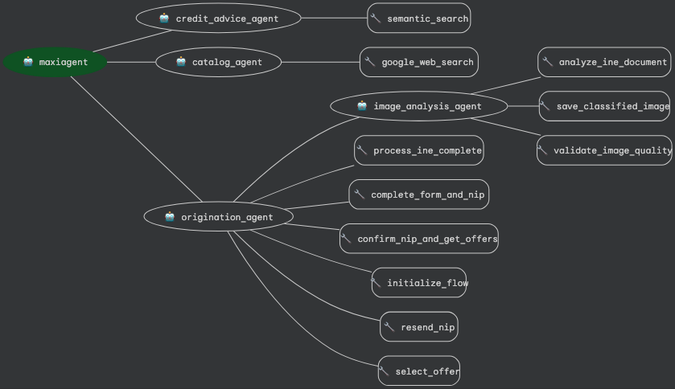

# MaxiAgent - Multi-Agent Motorcycle Finance Engine

## Table of Contents

- [Overview](#overview)
- [Agent Details](#agent-details)
- [Multi-Agent System Architecture](#multi-agent-system-architecture)
  - [Root Coordinator Agent](#-root-coordinator-agent)
  - [Credit Advice Agent](#-credit-advice-agent)
  - [Catalog Agent](#-catalog-agent)
  - [Origination Agent](#-origination-agent)
  - [Image Analysis Agent](#-image-analysis-agent-sub-agent-of-origination)
- [Key Features](#key-features)
  - [Motorcycle Catalog Consultation](#️-motorcycle-catalog-consultation)
  - [Credit Advisory Services](#-credit-advisory-services)
  - [End-to-End Quotation Flow](#-end-to-end-quotation-flow)
  - [Intelligent Document Analysis](#-intelligent-document-analysis)
- [Core Capabilities](#core-capabilities)
- [Setup and Installation](#setup-and-installation)
  - [Prerequisites](#prerequisites)
  - [Project Setup](#project-setup)
- [Running the Agent](#running-the-agent)
  - [Local Development](#local-development)
  - [Example Interactions](#example-interactions)
- [Deployment](#deployment)
  - [Deploy to Vertex AI Agent Engine](#deploy-to-vertex-ai-agent-engine)
  - [Deployment Commands](#deployment-commands)
  - [Deployment Configuration](#deployment-configuration)
  - [Environment Management](#environment-management)
- [Development](#development)
  - [Multi-Agent Project Structure](#multi-agent-project-structure)
  - [Adding New Tools](#adding-new-tools)
  - [Testing](#testing)
- [Configuration](#configuration)
- [Customization](#customization)
  - [Modify Agent Behavior](#modify-agent-behavior)
  - [Integrate Additional APIs](#integrate-additional-apis)
- [Supported Motorcycle Brands](#supported-motorcycle-brands)
- [Multi-Agent Benefits](#multi-agent-benefits)
- [Disclaimer](#disclaimer)

---

## Overview

MaxiAgent is an AI-powered **multi-agent system** specialized in motorcycle financing for Maxikash. The system orchestrates multiple specialized agents to provide expert consultation on motorcycle credits, generate personalized quotations, and offer up-to-date information about motorcycle catalogs from partner brands (Italika, Bajaj, Vento).

The multi-agent engine combines Retrieval-Augmented Generation (RAG) technology with Google Cloud's Agent Development Kit to deliver comprehensive financial advisory services through specialized agents that handle different aspects of the customer journey.

## Agent Details
| Attribute         | Details                                                                                                                                                                                             |
| :---------------- | :-------------------------------------------------------------------------------------------------------------------------------------------------------------------------------------------------- |
| **Interaction Type** | Conversational                                                                                                                                                                                      |
| **Complexity**    | Advanced Multi-Agent System
| **Agent Type**    | **Multi-Agent Architecture** with Coordinator and Specialized Sub-Agents                                                                                                                                                                                        |
| **Components**    | Root Coordinator, Credit Advisor, Catalog Consultant, Origination Specialist, Image Analysis Specialist                                                                                                                                                                               |
| **Vertical**      | Financial Services - Motorcycle Financing                                                                                                               |

### Multi-Agent Architecture



## Multi-Agent System Architecture

MaxiAgent operates as a **multi-agent engine** with a coordination layer that manages specialized sub-agents:

### 🎯 **Root Coordinator Agent**
- **Primary Role**: Orchestrates and coordinates between specialized agents
- **Functions**:
  - Analyzes user queries and determines appropriate agent routing
  - Maintains conversation flow and context between agents
  - Provides initial greeting and system overview
  - Ensures coherent user experience across agent interactions

### 🏦 **Credit Advice Agent**
- **Specialization**: Credit and financing consultation
- **Tools**: Semantic search with RAG for credit information
- **Expertise**:
  - Financing processes and requirements
  - Documentation guidance
  - Payment options and interest rates
  - Eligibility assessments
- **Guidance**: Actively guides users toward quotation or catalog consultation

### 🏍️ **Catalog Agent**
- **Specialization**: Motorcycle catalog consultation
- **Tools**: Real-time web search for motorcycle information
- **Expertise**:
  - Italika, Bajaj, and Vento motorcycle catalogs
  - Current pricing and specifications
  - Model recommendations by category (work, scooter, sports, tricycle, chopper, urban)
  - Technical specifications
- **Guidance**: Suggests quotation when user shows interest in specific models

### 📋 **Origination Agent**
- **Specialization**: Complete quotation flow from document capture to offer generation
- **Sub-Agent**: Image Analysis Agent for INE document processing
- **Tools**: Chained tools for automated multi-step processes
- **Workflow**:
  1. **Document Capture**: Analyzes INE (Mexican ID) images via Image Analysis sub-agent
  2. **INE Processing**: Sends documents to API, validates CURP
  3. **Data Collection**: Gathers user information (phone, email, motorcycle price)
  4. **NIP Verification**: Requests and confirms 6-digit NIP (when required)
  5. **Offer Generation**: Queries and presents personalized financing offers
  6. **Offer Selection**: Processes user's chosen payment plan
- **Advanced Features**:
  - Conditional NIP flow (skips NIP when not required)
  - Automatic error handling and retries
  - Structured offer formatting with markdown tables

### 🔍 **Image Analysis Agent** (Sub-agent of Origination)
- **Specialization**: Mexican ID (INE/IFE) document analysis
- **Function**: Classifies INE images as FRONT or BACK
- **Integration**: Called automatically by Origination Agent during quotation process
- **Features**:
  - Intelligent image classification
  - Quality validation
  - Saves classified images as artifacts

## Key Features

### 🏍️ **Motorcycle Catalog Consultation**
- **Brand Coverage**: Italika, Bajaj, and Vento motorcycles
- **Real-time Search**: Up-to-date pricing and specifications via Google Custom Search
- **Category Filtering**: Work, scooters, sports, tricycles, choppers, urban
- **Detailed Information**: Technical specifications, pricing, and availability
- **Smart Guidance**: Automatically suggests quotation when user shows interest

### 💰 **Credit Advisory Services**
- **RAG-powered Responses**: Intelligent document retrieval from knowledge base
- **Semantic Search**: Contextual search through credit documentation
- **Financing Process**: Complete guidance on requirements and documentation
- **Payment Options**: Information on terms, rates, and payment schedules
- **User Guidance**: Directs users to catalog or quotation based on needs

### 📋 **End-to-End Quotation Flow**
- **Document Processing**: Automated INE (Mexican ID) image analysis and classification
- **CURP Validation**: Automatic validation through government data
- **Chained Workflow**: Automated multi-step process with minimal user intervention
- **Conditional Logic**: Smart NIP verification (only when required by the system)
- **Multiple Offers**: Presents various financing options with different payment terms
- **Structured Presentation**: Clean markdown tables with pricing breakdown
- **Offer Selection**: Streamlined selection and confirmation process

### 🔍 **Intelligent Document Analysis**
- **INE Classification**: Automatic detection of front vs. back of Mexican ID
- **Image Quality Validation**: Ensures documents are clear and readable
- **Artifact Management**: Secure storage of processed document images
- **Integration**: Seamless delegation from Origination to Image Analysis agent

## Core Capabilities

### Tools by Agent:

#### Credit Advice Agent:
- **`semantic_search`**: RAG-based contextual search through credit documentation

#### Catalog Agent:
- **`google_web_search`**: Real-time web search for motorcycle catalogs from official sites

#### Origination Agent - Chained Tools:
- **`process_ine_complete`**: Automated INE processing + CURP validation
- **`complete_form_and_nip`**: Form submission + conditional NIP request
- **`confirm_nip_and_get_offers`**: NIP confirmation (if required) + offer generation

#### Origination Agent - Basic Tools:
- **`initialize_flow`**: Starts new quotation process with unique UUID
- **`resend_nip`**: Resends NIP code to user's phone
- **`select_offer`**: Confirms user's selected financing plan

#### Image Analysis Agent:
- **`analyze_ine_document`**: Classifies INE image as FRONT or BACK
- **`save_classified_image`**: Stores processed images as artifacts
- **`validate_image_quality`**: Checks image clarity and readability

### Quotation Flow Requirements:
The Origination Agent automatically collects:
1. **INE Images** (Front and Back) - via Image Analysis sub-agent
2. **CURP** - Extracted and validated from INE
3. **Phone Number** (`celular`)
4. **Email** (`email`)
5. **Motorcycle Price** (`precio_moto`) - Estimated price
6. **NIP Code** (6 digits) - Only when required by the system

## Setup and Installation

### Prerequisites

- **Google Cloud Account**: Active GCP project with billing enabled
- **Python 3.11+**: Ensure you have Python 3.11 or later version installed
- **Poetry**: Install Poetry for dependency management: [https://python-poetry.org/docs/](https://python-poetry.org/docs/)
- **Git**: Version control system

### Project Setup

1. **Clone the Repository:**
   ```bash
   git clone <repository-url>
   cd maxiagent
   ```

2. **Install Dependencies with Poetry:**
   ```bash
   poetry install
   ```

3. **Activate the Poetry Environment:**
   ```bash
   poetry shell
   ```
   Or alternatively:
   ```bash
   source .venv/bin/activate
   ```

4. **Set up Environment Variables:**
   Create a `.env` file based on the following template:
   ```env
   # Google Cloud Configuration
   GOOGLE_CLOUD_PROJECT=your-project-id
   GOOGLE_CLOUD_LOCATION=us-central1

   # Agent Configuration
   ROOT_AGENT_MODEL=gemini-1.5-pro
   AGENT_ENGINE_ID=projects/YOUR_PROJECT/locations/us-central1/reasoningEngines/YOUR_ENGINE_ID

   # RAG Configuration
   RAG_CORPUS=projects/YOUR_PROJECT/locations/us-central1/ragCorpora/YOUR_CORPUS_ID
   EMBEDDING_MODEL_NAME=text-embedding-004

   # Google Search API
   GOOGLE_SEARCH_API_KEY=your-google-search-api-key
   GOOGLE_CSE_ID=your-custom-search-engine-id

   # Environment
   FLASK_ENV=dev

   # External APIs - Development
   URL_CALCULADORA_DEV=https://your-calculator-api-dev.com
   KEY_CALCULADORA_DEV=your-calculator-api-key-dev
   API_MAXIKASH_DEV=https://your-maxikash-api-dev.com

   # External APIs - Production
   URL_CALCULADORA_PROD=https://your-calculator-api-prod.com
   KEY_CALCULADORA_PROD=your-calculator-api-key-prod
   API_MAXIKASH_PROD=https://your-maxikash-api-prod.com

   # Database Configuration (for RAG)
   POSTGRE_IP_PUBLIC=your-public-postgres-ip
   POSTGRE_IP_PRIVATE=your-private-postgres-ip
   POSTGRE_PORT=5432
   POSTGRE_USR_RAG_REPO_DEV=your-postgres-username
   POSTGRE_PASS_RAG_REPO_DEV=your-postgres-password
   POSTGRE_DB_RAG_REPO=your-database-name
   ```

5. **Authenticate with Google Cloud:**
   ```bash
   gcloud auth application-default login
   ```

## Running the Agent

### Local Development

1. **Run agent in CLI:**
   ```bash
   adk run maxiagent
   ```

2. **Run agent with ADK Web UI:**
   ```bash
   adk web
   ```
   Then select MaxiAgent from the dropdown.

### Example Interactions

**Credit Consultation:**
```
User: ¿Qué documentos necesito para un crédito de moto?
Agent: [Credit Advice Agent uses semantic_search to retrieve documentation requirements]
       [Guides user toward catalog consultation or quotation]
```

**Catalog Search:**
```
User: ¿Qué motos de trabajo tiene Italika?
Agent: [Catalog Agent uses google_web_search to find current Italika work motorcycles]
       [Presents models with pricing in structured tables]
       [Suggests quotation if user shows interest]
```

**Complete Quotation Flow:**
```
User: Quiero cotizar una moto
Agent: [Origination Agent initializes flow]
       Perfecto, por favor envía las fotos de tu INE (frente y reverso)

User: [Sends INE images]
Agent: [Delegates to Image Analysis Agent for classification]
       [Automatically processes INE and validates CURP]
       Necesito algunos datos adicionales:
       - ¿Cuál es tu número de celular?
       - ¿Tu correo electrónico?
       - ¿Cuál es el precio estimado de la moto que te interesa?

User: [Provides data]
Agent: [Submits form and conditionally requests NIP]
       [If NIP required] Revisa tu celular, te enviamos un código de 6 dígitos
       [If NIP not required] Procesando...

User: [Provides NIP if required]
Agent: [Confirms NIP and generates offers]
       [Presents multiple financing options in structured tables]
       ¿Cuál opción prefieres?

User: Opción 2
Agent: [Confirms selection]
       ¡Perfecto! Tu solicitud ha sido enviada a análisis.
```

## Deployment

### Deploy to Vertex AI Agent Engine

The deployment script (`deployment/deploy.py`) provides comprehensive agent lifecycle management using the Vertex AI Agent Engines API.

#### Prerequisites

Ensure your `.env` file contains the required variables for your target environment:

**Development Environment:**
- `GOOGLE_CLOUD_PROJECT`, `GOOGLE_CLOUD_LOCATION`, `STAGING_BUCKET`
- `RAG_CORPUS`, `GOOGLE_CSE_ID`, `GOOGLE_SEARCH_API_KEY`
- `ROOT_AGENT_MODEL`, `ENV` (set to "dev")
- `URL_CALCULADORA_DEV`, `KEY_CALCULADORA_DEV`, `API_MAXIKASH_DEV`
- `URL_ORIGINADOR_DEV`, `KEY_ORIGINADOR_DEV`
- `URL_DATA_MAXI_DEV`, `USRNAME_DATA_MAXI_DEV`, `PASSWORD_DATA_MAXI_DEV`
- `ADK_ARTIFACT_BUCKET`

**Production Environment:**
- Same as dev but with `_PROD` suffix variables and `ENV=prod`

#### Deployment Commands

**1. Create a New Agent:**
```bash
python deployment/deploy.py --create --display-name "MaxiAgent Dev" --env dev
```

**For Production:**
```bash
python deployment/deploy.py --create --display-name "MaxiAgent Prod" --env prod
```

**What happens during creation:**
- Creates a new Vertex AI Agent Engine
- Uploads agent code and dependencies
- Configures environment variables based on specified environment (dev/prod)
- Sets up auto-scaling (min: 1, max: 10 instances)
- Enables distributed tracing
- Returns the agent resource ID

**2. Update an Existing Agent:**
```bash
python deployment/deploy.py --update --resource-id <AGENT_ENGINE_ID> --env dev
```

Example:
```bash
python deployment/deploy.py --update --resource-id 1234567890123456789 --env dev
```

**What happens during update:**
- Updates agent code and logic without creating a new resource
- Refreshes dependencies and requirements
- Updates environment variables
- Preserves the same resource ID

**3. Delete an Agent:**
```bash
python deployment/deploy.py --delete --resource-id <AGENT_ENGINE_ID>
```

**Note:** Uses `force=True` to delete even if there are active sessions or associated memory.

#### Deployment Configuration

The deployment automatically includes:

**Required Packages:**
- `google-cloud-aiplatform[adk,agent_engines]>=1.118.0`
- `google-adk>=1.15.1`
- `python-dotenv`, `google-auth`, `requests`
- `llama_index`, `langchain-google-vertexai`
- `beautifulsoup4`, `tqdm`, `deprecated`

**Auto-scaling Settings:**
- Minimum instances: 1 (keeps agent warm)
- Maximum instances: 10 (handles traffic spikes)

**Additional Features:**
- Distributed tracing enabled for debugging
- Custom packages: `./maxiagent` (entire agent codebase)
- Environment-specific configurations (dev/prod)

#### Post-Deployment

**Grant Necessary Permissions:**
```bash
chmod +x deployment/grant_permissions.sh
./deployment/grant_permissions.sh
```

**Test the Deployed Agent:**
```bash
python deployment/run.py
```

#### Environment Management

The script supports two environments:
- **`dev`**: Uses development API endpoints and credentials
- **`prod`**: Uses production API endpoints and credentials

Always specify `--env` when creating or updating agents to ensure correct configuration is loaded.

## Development

### Multi-Agent Project Structure

```
maxiagent/
├── __init__.py
├── agent.py                                    # 🎯 Root coordinator agent
│
├── core/                                       # ⚙️ Core system components
│   ├── __init__.py
│   ├── config.py                              # Environment & configuration
│   └── logging.py                             # Logging utilities
│
├── prompts/                                    # 💬 Prompt management
│   ├── __init__.py
│   ├── base_prompts.py                        # Base class with validation
│   └── root_agent_prompts.py                  # Root coordinator prompts
│
├── tools/                                      # 🛠️ Tool management
│   ├── __init__.py
│   ├── base_tools.py                          # Base class for all tools
│   └── root_agent_tools.py                    # Root coordinator tools
│
├── sub_agents/                                 # 🤖 Multi-agent architecture
│   ├── __init__.py
│   │
│   ├── credit_advice_agent/                   # 🏦 Credit & financing specialist
│   │   ├── __init__.py
│   │   ├── agent.py
│   │   ├── prompts/
│   │   │   ├── __init__.py
│   │   │   └── credit_advice_prompts.py
│   │   └── tools/
│   │       ├── __init__.py
│   │       └── credit_advice_tools.py         # RAG semantic search
│   │
│   ├── catalog_agent/                         # 🏍️ Motorcycle catalog specialist
│   │   ├── __init__.py
│   │   ├── agent.py
│   │   ├── prompts/
│   │   │   ├── __init__.py
│   │   │   └── catalog_prompts.py
│   │   └── tools/
│   │       ├── __init__.py
│   │       └── catalog_tools.py               # Web search integration
│   │
│   ├── origination_agent/                     # 📋 Quotation flow specialist
│   │   ├── __init__.py
│   │   ├── agent.py
│   │   ├── prompts/
│   │   │   ├── __init__.py
│   │   │   └── origination_prompts.py
│   │   └── tools/
│   │       ├── __init__.py
│   │       └── origination_tools.py           # Chained workflow tools
│   │
│   └── image_analysis_agent/                  # 🔍 INE document specialist
│       ├── __init__.py
│       ├── agent.py
│       ├── prompts/
│       │   ├── __init__.py
│       │   └── analysis_prompts.py
│       └── tools/
│           ├── __init__.py
│           └── analysis_tools.py              # Image classification
│
└── utils/                                      # 🔧 Shared utilities
    ├── __init__.py
    └── utils.py
```

**Architecture Overview:**

| Component | Description | Key Features |
|-----------|-------------|--------------|
| **🎯 Root Agent** | Orchestrates all sub-agents | Routing, context management, coordination |
| **🏦 Credit Advice** | Financial consultation | RAG semantic search, documentation guidance |
| **🏍️ Catalog Agent** | Motorcycle information | Real-time web search, brand catalogs |
| **📋 Origination** | Quotation workflow | Chained tools, automated multi-step flow |
| **🔍 Image Analysis** | Document processing | INE classification, quality validation |

### Adding New Tools

#### For Existing Agents:
1. Add the tool function to the appropriate agent's tools file (e.g., `maxiagent/sub_agents/credit_advice_agent/tools/credit_advice_tools.py`)
2. Ensure the tools class inherits from `BaseAgentTools`
3. Register it in the agent's `_tools` dictionary under an appropriate category
4. Update the agent's prompt instructions in the corresponding prompts file

#### For New Specialized Agents:
1. Create a new agent directory under `maxiagent/sub_agents/`
2. Follow the established structure:
   ```
   new_agent/
   ├── __init__.py
   ├── agent.py
   ├── prompts/
   │   ├── __init__.py
   │   └── new_agent_prompts.py  # Must inherit from BaseAgentPrompts
   └── tools/
       ├── __init__.py
       └── new_agent_tools.py    # Must inherit from BaseAgentTools
   ```
3. Ensure prompts class includes all required sections (role, tools_usage, restrictions, global_restrictions)
4. Import and register the new agent in `maxiagent/sub_agents/__init__.py`
5. Add the agent to the root coordinator's sub_agents list in `maxiagent/agent.py`

### Testing

Run tests using pytest:
```bash
poetry run pytest eval/
```

## Configuration

### Environment-Specific Settings

The agent supports multiple environments (dev/prod) with different API endpoints and configurations. Set `FLASK_ENV=dev` or `FLASK_ENV=prod` to switch between environments.

### Database Configuration

For RAG functionality, configure PostgreSQL with pgvector extension for embedding storage and semantic search capabilities.

## Customization

### Modify Agent Behavior

#### Root Coordinator:
- **Prompts**: Edit `maxiagent/prompts/root_agent_prompts.py` to change coordination behavior
- **Configuration**: Adjust settings in `maxiagent/core/config.py`
- **Logging**: Configure logging behavior in `maxiagent/core/logging.py`
- **Global Instructions**: Modify `BaseAgentPrompts.get_global_instruction()` for system-wide behavior

#### Specialized Agents:
- **Credit Advice**: Modify `maxiagent/sub_agents/credit_advice_agent/prompts/credit_advice_prompts.py`
- **Catalog Consultation**: Modify `maxiagent/sub_agents/catalog_agent/prompts/catalog_prompts.py`
- **Origination Flow**: Modify `maxiagent/sub_agents/origination_agent/prompts/origination_prompts.py`
- **Image Analysis**: Modify `maxiagent/sub_agents/image_analysis_agent/prompts/analysis_prompts.py`

#### Standardized Prompt Structure:
All prompts must include required sections (validated automatically):
- `role`: Agent's objective and when it acts
- `tools_usage`: Available tools and when to use them
- `restrictions`: Agent-specific restrictions
- `global_restrictions`: System-wide restrictions (inherited)

See `SECTIONS_STANDARD.md` in the project root for details.

#### Tools:
- **Base Classes**: All tools inherit from `BaseAgentTools` for consistency
- **Distributed Tools**: Each agent has its own specialized tools in their respective `tools/` directories
- **Shared Utilities**: Common functions are available in `maxiagent/utils/utils.py`

### Integrate Additional APIs
- Add new API configurations to the config classes
- Create corresponding tool functions in the appropriate specialized agent
- Update the specific agent's prompts to include new capabilities
- Ensure tools class inherits from `BaseAgentTools`
- Consider creating a new specialized agent if the functionality is substantial enough

## Supported Motorcycle Brands

- **Italika**: Work motorcycles, scooters, urban bikes
- **Bajaj**: Various motorcycle categories
- **Vento**: Complete motorcycle lineup

For other brands, the agent will redirect users to the supported options.

## Multi-Agent Benefits

The multi-agent architecture provides several advantages:

- **Specialized Expertise**: Each agent focuses on a specific domain, providing more accurate and relevant responses
- **Hierarchical Structure**: Sub-agents can have their own sub-agents (e.g., Image Analysis within Origination)
- **Scalability**: New agents can be added without affecting existing functionality
- **Maintainability**: Code is organized by functionality with standardized base classes
- **Performance**: Specialized agents can be optimized for their specific tasks
- **Modularity**: Agents can be developed, tested, and deployed independently
- **Standardization**: Base classes ensure consistent behavior across all agents
- **Validation**: Automatic validation of prompts and tools ensures quality and consistency
- **Chained Operations**: Complex workflows automated through chained tools (e.g., Origination flow)

## Disclaimer

This project is designed as a multi-agent motorcycle financing consultation and quotation generation system. All financial calculations are provided through external APIs and should be verified for accuracy. The agents are intended for informational and consultation purposes within the Maxikash ecosystem.